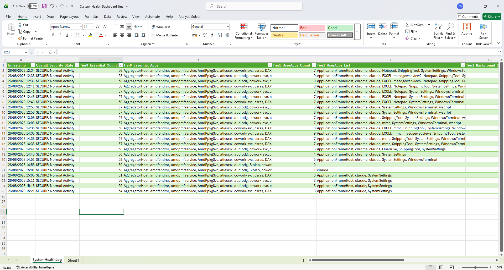
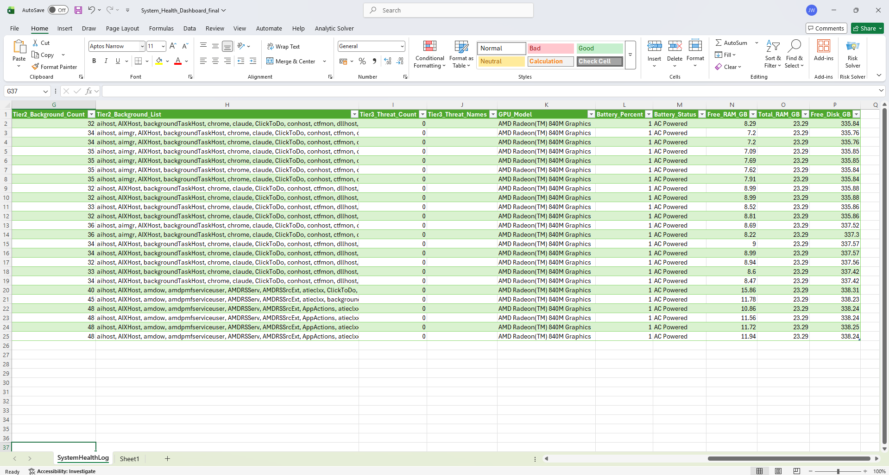

# Automated System Telemetry & Performance Logging Pipeline

An automated background system telemetry pipeline built for personal Windows endpoint monitoring. The system extracts hardware performance metrics, live power telemetry, and categorized process architecture every 5 minutes using **PowerShell** and **WMI/CIM APIs**, storing diagnostic logs locally for analytical ingestion in **Microsoft Excel** via **Power Query**.

---

## Technical Context & Security Rationale

- **Purpose & Scope:** Developed strictly for local personal endpoint monitoring and resource profiling on single-user workstations.
- **Background Execution:** Uses a light VBScript wrapper (`Run-Hidden.vbs`) solely to suppress command prompt window flicker and prevent desktop focus interruption every 5 minutes during active workstation use.

---

## Architecture Overview

- **Trigger:** Windows Task Scheduler executes every 5 minutes (Non-Interactive).
- **Wrapper (`Run-Hidden.vbs`):** Suppresses GUI console window creation to avoid desktop focus-stealing.
- **Core Engine (`Run-SystemUtility.ps1`):**
  - **Self-locating:** Resolves its own log and backup paths dynamically via `$PSScriptRoot`, so the script works correctly regardless of which folder it's placed in — no hardcoded paths to keep in sync.
  - **Hardware Metrics:** Queries WMI / CIM APIs (RAM usage, C-Drive storage, GPU model).
  - **Power Metrics:** Queries `System.Windows.Forms` (AC status, battery percentage).
  - **Process Classification:** Evaluates running tasks into 3 distinct tiers via `.NET HashSet` lookups.
- **Data Destination (`SystemHealthLog.csv`):** Appends structured UTF-8 diagnostic records via non-locking stream writer, written to the same folder as the script itself.
- **Analytics Layer (`Microsoft Excel`):** Power Query engine ingests and auto-refreshes data model every 5 minutes.

### Script Inspection & Code Review
To inspect the underlying PowerShell implementation, resource collections, and non-locking file stream logic, view the core script file directly:
[`Run-SystemUtility.ps1`](./Run-SystemUtility.ps1)

---

## Dashboard Preview





---

## Key Features & Reliability

- **Resource & Hardware Telemetry:** Collects available memory (GB), total RAM (GB), C-drive free space (GB), and active Display Adapter GPU model via CIM/WMI.
- **Power Telemetry & Desktop Edge Cases:** Queries `System.Windows.Forms.SystemInformation`. For desktop PCs lacking a physical battery, metrics gracefully record as `N/A / AC Powered` without throwing script exceptions.
- **3-Tiered Process Categorization:** Evaluates running processes against `.NET HashSet[string]` lookups for fast memory management:
  - **Tier 0 (Core System):** Session 0 / essential OS processes (`svchost`, `csrss`, `explorer`, `dwm`).
  - **Tier 1 (User Applications):** Active foreground user software (`chrome`, `powershell`, `mmc`).
  - **Tier 2 (Background Services):** Helper tools and unclassified services.
  - **Tier 3 (Threat Indicators):** Proactive detection tier tracking flagged processes or unauthorized binary execution patterns.

### Tier 3 Detection Engine & Security Logic
The engine evaluates active running processes against a dedicated `.NET HashSet[string]` threat signature array (`$Tier3_Threats`) and path heuristic rules during every 5-minute cycle:
- **Signature Matching:** Evaluates active process names against known-suspicious binary names (e.g. common remote-execution or credential-dumping utilities).
- **Path Verification:** Identifies binaries executing out of temporary or non-standard user directories (e.g. `AppData\Local\Temp` or `C:\Users\Public`).
- **State Evaluation:**
  - **`0` Threat Matches:** Flags log output as `SECURE: Normal Activity`.
  - **`>= 1` Threat Matches:** Escalates state to `WARNING: Suspicious Binary Detected` and logs the specific process names and PIDs to the CSV payload for triage.

- **File-Lock Resilience & Error Handling:** Appends records using non-locking UTF-8 file streams so background writes succeed even while Excel or an external viewer has `SystemHealthLog.csv` open for reading. Core hardware queries (RAM, disk) are wrapped in error handling so a single failed query doesn't crash the scheduled run.

---

## Sample CSV Diagnostic Output

```csv
Timestamp,Overall_Security_State,Tier0_Essential_Count,Tier0_Essential_Apps,Tier1_UserApps_Count,Tier1_UserApps_List,Tier2_Background_Count,Tier2_Background_List,Tier3_Threat_Count,Tier3_Threat_Names,GPU_Model,Battery_Percent,Battery_Status,Free_RAM_GB,Total_RAM_GB,Free_Disk_GB
2026-08-26 12:34:55,SECURE: Normal Activity,56,"AggregatorHost, amdfendrsr, csrss, dwm...",7,"chrome, Notepad, SystemSettings",32,"AIXHost, backgroundTaskHost, chrome...",0,,AMD Radeon(TM) 840M Graphics,100%,AC Powered,8.29,23.29,335.84
```

---

## Setup & Deployment

### Prerequisites
- **OS:** Windows 10 / 11 (64-bit)
- **PowerShell:** Version 5.1 or higher
- **Permissions:** Standard User execution (Admin rights are not required for basic WMI/CIM system queries)
- **Visualization:** Microsoft Excel 2016+ with Power Query enabled

### Installation Steps

1. **Clone the repository into any folder you like** — the script no longer requires a specific path:
   ```cmd
   git clone https://github.com/JackBraun01/windows-telemetry-pipeline.git "C:\IT_Projects\Windows telemetry project"
   ```
   `Run-SystemUtility.ps1` automatically detects its own folder and writes `SystemHealthLog.csv` and `Backups\` right next to itself — no editing required inside the script itself.

2. **Point `Run-Hidden.vbs` at the script's actual location.** This is the one path that still needs to be set manually, since Windows needs to be told where to look *before* the script can run and locate itself. Open `Run-Hidden.vbs` and confirm the path matches wherever you cloned the repo:
   ```vbscript
   CreateObject("Wscript.Shell").Run "powershell.exe -ExecutionPolicy Bypass -File ""C:\IT_Projects\Windows telemetry project\Run-SystemUtility.ps1""", 0, False
   ```

3. **Set your execution policy for the session** before testing manually — Windows blocks unsigned scripts by default, and you WILL see an error without this step (see Troubleshooting below):
   ```powershell
   Set-ExecutionPolicy -Scope Process -ExecutionPolicy Bypass
   ```
   This is only needed for manual testing — the automated Task Scheduler run doesn't need it, since `Run-Hidden.vbs` already calls PowerShell with `-ExecutionPolicy Bypass` built in.

4. **Register the Scheduled Task**, pointing at wherever `Run-Hidden.vbs` actually lives:
   ```powershell
   $action = New-ScheduledTaskAction -Execute "wscript.exe" -Argument "`"C:\IT_Projects\Windows telemetry project\Run-Hidden.vbs`""
   $trigger = New-ScheduledTaskTrigger -At (Get-Date) -Once -RepetitionInterval (New-TimeSpan -Minutes 5)
   Register-ScheduledTask -TaskName "SystemHealthMonitor" -Action $action -Trigger $trigger -Description "5-minute background system diagnostic logger"
   ```

5. **Configure Excel Ingestion:**
   1. Open Microsoft Excel and create a new blank workbook, saved into the same project folder.
   2. Navigate to **Data** → **Get Data** → **From File** → **From Text/CSV**.
   3. Select `SystemHealthLog.csv` from the project folder and click **Transform Data**, then **Close & Load**.
   4. Under **Data** → **Queries & Connections**, right-click the query → **Properties**.
   5. Enable **Refresh every 5 minutes** and **Refresh data when opening the file**.

6. **Test it:**
   ```powershell
   cd "C:\IT_Projects\Windows telemetry project"
   .\Run-SystemUtility.ps1
   ```
   You should see `Diagnostic record logged successfully!` in green, and a new row appear in `SystemHealthLog.csv`.

---

## Troubleshooting

Real issues encountered setting this up, and their fixes:

**"File ... cannot be loaded. The file ... is not digitally signed."**
Windows blocks unsigned scripts by default. Run `Set-ExecutionPolicy -Scope Process -ExecutionPolicy Bypass` in your PowerShell window before testing manually. This only applies to that one window — you'll need to run it again each time you open a fresh PowerShell session to test.

**Windows Script Host error: "Can not find script file ... Run-Hidden.vbs"**
Task Scheduler's action is pointing at the wrong path. Open the task's Properties → Actions tab → Edit, and check the **"Add arguments"** field specifically (not "Program/script," which should just say `wscript.exe`) — it needs the full, correctly quoted path to wherever `Run-Hidden.vbs` actually lives, e.g. `"C:\IT_Projects\Windows telemetry project\Run-Hidden.vbs"`.

**Script says "logged successfully" but the CSV never shows new data**
Check for a leftover duplicate Scheduled Task from an earlier setup attempt — having two tasks pointed at different script copies (one old, one current) causes exactly this kind of "it worked, but where did it go" confusion. Check Task Scheduler Library for duplicates and disable/delete the old one.

**Two scheduled tasks both firing, causing intermittent random errors**
If you registered the task more than once (e.g. once via PowerShell script, once via the Task Scheduler wizard), you may end up with two separate tasks both running every 5 minutes independently. Check Task Scheduler Library for duplicates and keep only one.

**Excel shows old/stale data after adding a new CSV column**
Power Query's `Source` step can lock in a fixed column count on first setup. If you add a column to the CSV later (e.g. customizing the Tier 3 logic), open Power Query Editor → click the `Source` step → check the formula bar for a `Columns=` parameter and update the number to match your new total column count.

**Renamed test files (e.g. testing threat detection) won't run, or vanish immediately**
This is very likely your own antivirus/EDR software correctly doing its job — renaming an executable to mimic a known suspicious tool is a real detection pattern, and legitimate security software will block or kill it. This is expected behavior, not a bug in this script.

**`git push` rejected: "Updates were rejected because the remote contains work that you do not have locally"**
Someone (including you, via GitHub's web editor) made a change directly on GitHub that your local copy doesn't have. Run `git pull origin main` first to merge those changes down, resolve any file conflicts, then push again.

**A README (or any file) you upload to GitHub doesn't render / shows a placeholder**
GitHub only auto-renders a file named *exactly* `README.md`. Windows often hides file extensions by default, so a rename can silently produce something like `README.md.md` without you noticing. Enable File Explorer → View → "File name extensions" to always see the true filename.

---

## Known Limitations

- **Data and log paths are self-resolving** (via `$PSScriptRoot`), but `Run-Hidden.vbs` and the registered Scheduled Task still need to be manually pointed at wherever you place the project — Windows has to be told where to start looking before the script can locate itself. Moving the folder after setup requires updating those two references together.
- **Data files are not included in this repo:** `SystemHealthLog.csv` and any `.xlsx` dashboard file are excluded via `.gitignore`, since they contain live system data from the machine they were generated on. Cloning this repo gives you the pipeline itself, not pre-populated data — you'll start with an empty log.
- **Excel Concurrent Locks:** Power Query maintains a brief read-only lock during data syncs. Streaming appends prevent write collisions, but manually editing the raw CSV during a refresh cycle may cause temporary file access contention.
- **Virtual Machines:** On hypervisors without virtual GPU pass-through, the GPU query defaults to standard display driver strings (e.g., `Basic Display Adapter`).
- **Security software interaction:** Endpoint protection software (Windows Defender, EDR tools, etc.) may quarantine or terminate processes launched from non-standard locations such as `C:\Users\Public\`, which can interfere with manually testing the Tier 3 path-detection rule — this is expected behavior from legitimate security tooling, not a bug in the script.

---

## License
Distributed under the MIT License.
